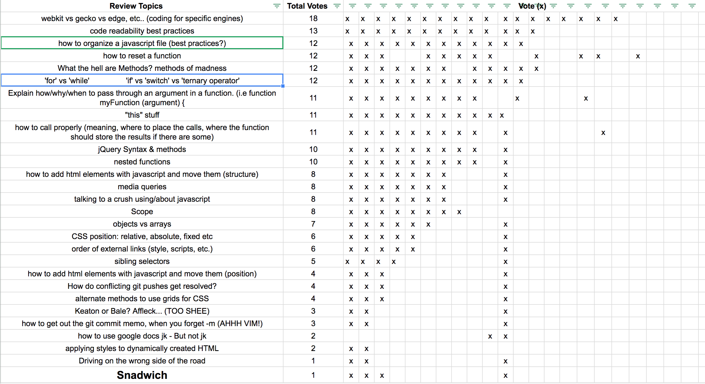

## Recap topics 8/22/17

#### Browser Engines (gecko, webkit etc)

- All browsers have are powered by an [engine](https://en.wikipedia.org/wiki/Web_browser_engine) that parses the CSS/HTML etc.
- Only time you will see it as a web dev is in [css vendor prefixes](https://developer.mozilla.org/en-US/docs/Glossary/Vendor_Prefix)
- In my time personally as a web dev, never really had to worry about it, auto prefixers exist for automatically adding vendor prefixes to css.

#### How to organize JS ([niceResetStructure.html](niceResetStructure.html))

- Group code logically (e.g defining variables, for loop, setting click handler), seperated by blank lines.
- Put longer sections of code into functions with descriptive names if possible.
- Use descriptive variable names.
- Experiment to find your personal preferences and format according to that!

#### 'How to reset a function' ([niceResetStructure.html](niceResetStructure.html))

- Have your key variables, e.g score counter, defined in a scope that is parent to all functions.
- use a function to set these key variables back to their initial value.
- Don't forget to also return the HTML to it's original state.

#### What the hell are Methods? ([methods.html](methods.html))

- A function that's on an object
- [methods MDN Article](https://developer.mozilla.org/en-US/docs/Glossary/Method)

#### for vs while ([forLoopsnwhile.html](forLoopsnwhile.html))

- while loops can very easily cause infinite loops that cause crashes
- a common pattern using 'for loops' is to do the same operation to every element in an array.
- [looping in javascript MDN Article](https://developer.mozilla.org/en-US/docs/Web/JavaScript/Guide/Loops_and_iteration)

#### if vs switch ([ifTernary.html](ifTernary.html))

- switch can replace many if conditionals and save repeated logic if the ifs are all simple string equality tests. (better explained by example ^)
- [switch MDN article](https://developer.mozilla.org/en-US/docs/Web/JavaScript/Reference/Statements/switch)

#### Accessing deep objects ([ifTernary.html](ifTernary.html))

- When accessing a value that's deep in an object, to prevent throwing an error if a level is undefined, && can be used to test if a level exists before trying to access a property on it.

#### Ternary ([ifTernary.html](ifTernary.html))

- very compact syntax for doing inline simple conditionals.
- [ternary MDN Article](https://developer.mozilla.org/en-US/docs/Web/JavaScript/Reference/Operators/Conditional_Operator)

#### this ([thisness.html](./thisness.html))

- if a function is a method, `this` within the function is the object the method is on when called
- In a browser, if the function is not a method, this is the global window object.
- the same function can be defined, then attached as a method. When be called as a method, this will be the object, but the same function called from it's original definition will have the global this. Despite them being that same function!

